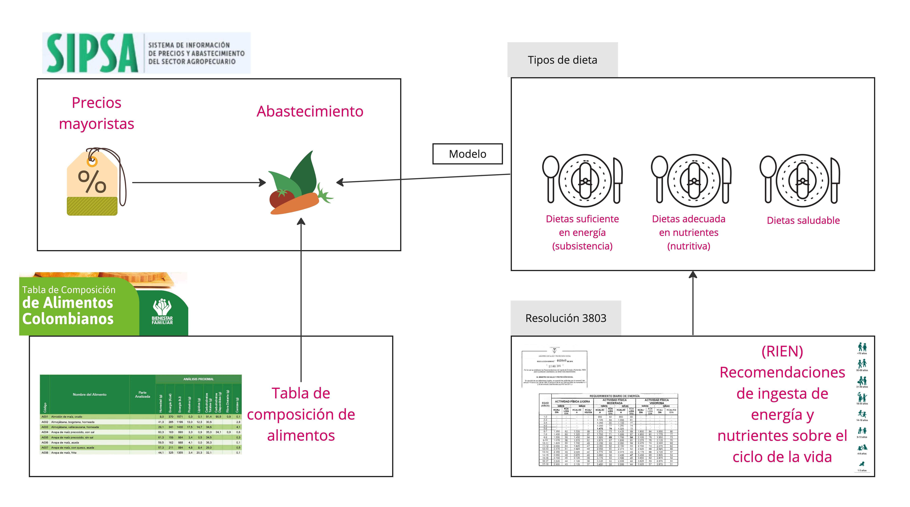
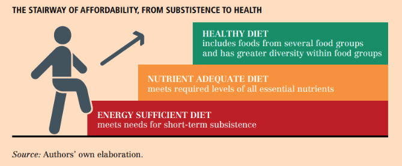

# Dieta Saludable para Antioquia

En este respositorio se encontrará todos los datos, códigos y procedimientos para la estimación de dieta saludable en Antioquia.

Este proyecto está liderado por: 
- FAO
- Corporación Universitaria Remington.
- Universidad Javeriana de Cali
- Centro de Incidencia - Valor Público de la Universidad EAFIT

El calculo se realizó utilizando el paquete *Foodprice 1.0.0*, desarrollado por la Universidad Javeriana de Cali (Fuente?)

## Composición de la carpeta

La composición de los carpetas sigue el protocolo de manejo de datos de **Plasa Colombia*, el cual estructura la información para su transparencia,  y replicabilidad.

- *input*: Bases de datos sin procesar
- *Scr*: Códigos de análisis
- *output*: Bases de datos finales

## Dinámica del proceso

El flujo de procesamiento compone los siguientes elementos

### Tipos de dieta

Se utiliza la definición estándar de dietas propuesta por la FAO 
    - **Dieta Suficiente de Energía**
    - **Dieta Adecuada en Nutrientes**
    - **Dieta Saludable**   

### Requerimientos nutricionales

Con el fin de adaptar la metodología a la realidad colombiana se utilizan *Guías Alimentarias Basadas en Alimentos para la Población Colombiana Mayor de 2 Años* [(GABAS)](https://www.icbf.gov.co/system/files/guias_alimentarias_basadas_en_alimentos_para_la_poblacion_colombiana_mayor_de_2_anos_0.pdf), relizado por El Instituto Colombiano de Bienestar Familiar (ICBF).

Las GABAS se utilizan para establecer, en cada grupo demográfico, las recomendaciones por grupos de alimentos en la estimación del CoRD. 

Por otro lado, se utiliza la *Encuesta Nacional de Situación Nutricional* [ENSIN 2015](https://www.icbf.gov.co/bienestar/nutricion/encuesta-nacional-situacion-nutricional#ensin3) para extraer las medidas antropométricas y los niveles de actividad física, lo permite estimar los requerimientos energéticos por sexo y grupos demográficos.

### Información sobre precios y cantidades

La información de disponibilidad y precios de alimentos provienen de dos fuentes de información. 

- Sistema de Información de Precios y Abastecimiento del Sector Agropecuario [(SIPSA)](https://www.dane.gov.co/index.php/estadisticas-por-tema/agropecuario/sistema-de-informacion-de-precios-sipsa). El cual, a su vez, tiene dos fuentes de información.
    - **SIPSA Precios**: Informa sobre las cotizaciones mayoristas de los principales productos agrícolas que componen la canasta de los alimentos.
    - **SIPSA Abastecimimiento**:Reporta el volumen de abastecimiento de productos en las principales ciudades del país.
- Sistema de Abastecimiento Agroalimentario de Antioquia **(SABA)**: Un proyecto liderado por la FAO y la Gobernación de Antioquia la cual recoge una rica información sobre precios y disponibilidad de alimentos. Entre las diferentes bases de datos se utilizan dos bases: 
    - *Sondeo Rápido de Comercio*: Inventario de comercios al por menor de los programas priorizados. 
        - **Comercio**: Nombre del comercio, Nombre rubro
        - **Origen**: ¿A quién le compra el rubro?, ¿Cuál plaza de mercad, ¿Cuál otro proveedor? , Lugar dónde compra el rubro, ¿Cuál es el otro municipio de antioquia?, ¿Cuál es el otro departamento?, ¿Cuál es el municipio del otro departamento?, ¿Cuál es el otro país?
        Frecuencia de compra del producto
        - **Volúmen**: Volumen de compra (kg)
        - **Precios**: Precio actual de compra del rubro, Margen precio comercio, Magen en % comercio, En lo que va corrido del 2023, ¿cuál ha sido el precio máximo de compra del producto por kg?, En lo que va corrido del 2023, ¿cuál ha sido el precio mínimo de compra del rubro por kg?
    - **Tracking de precios**: Donde se hace una revisión de los precios a lo largo del tiempo. La información que se recoge es la siguiente:
        - Rubros, ¿A que precio compró la última vez el producto?, Precio de venta del kilogramo el día de hoy, Margen precio comercio, Margen en % comercio

## Limitaciones

La propuesta metodológica es 
- No se tiene en cuenta los costos de preparación
- Se asume que se tienen los conocimientos y medios para una preparación adecuada

# Referencias

En este grupo de referencia puedes acceder a los documentos relevantes [Zotero - Refrencia ](https://www.zotero.org/groups/5428687/proyecto_dieta_saludable)

